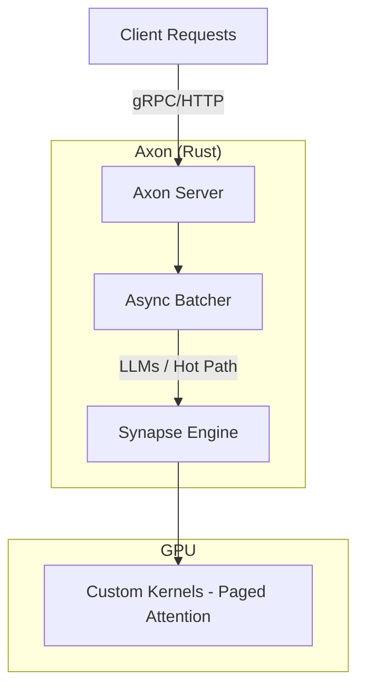

# Axon

**High-performance, Deterministic ML Inference Server**

Axon is a production-grade inference server engineered in Rust. It eliminates the Python runtime overhead found in traditional serving stacks (vLLM, TGI) to deliver **sub-10ms p99 latency**, predictable throughput, and memory safety.

## 🚀 Features

  - **Zero-Overhead Scheduling**: Async Rust (Tokio) architecture eliminates the GIL.
  - **Direct GPU Control**: Integrated tightly with [Synapse](https://github.com/yourname/synapse) for custom CUDA kernels.
  - **Dynamic Batching**: Request-level batching without Python loop overhead (Planned).
  - **Pure Rust Pipeline**: No external C++ runtime dependencies (like ONNX Runtime)—just raw CUDA via FFI.

## ⚡ Use Cases

  - **High-Frequency Trading / HFT**: Where microsecond latency variances matter.
  - **High-Throughput SaaS**: Maximizing requests-per-second per GPU dollar.
  - **Embedded / Edge**: Running heavy models on limited hardware (Orin/Jetson).
  - **Safety-Critical**: Environments where memory leaks and segfaults are unacceptable.

## 🏗 Architecture



## ⚖️ Axon vs. vLLM

Axon is designed for engineering teams hitting the limits of Python-based serving:

| Feature | vLLM / Python Stacks | Axon (Rust) |
| :--- | :--- | :--- |
| **Runtime** | Python (Interpreter) | Native Binary |
| **Concurrency** | Limited by GIL | True Async (Tokio) |
| **Latency** | Variable (GC Pauses) | Deterministic |
| **Memory** | High Overhead | Zero-Copy / Pinned |

**Choose Axon when you need to maximize hardware utilization and guarantee latency SLOs.**

## 🛠 Quick Start

```rust
use axon::server::InferenceServer;
use synapse::tensor::Tensor;

#[tokio::main]
async fn main() -> Result<(), Box<dyn std::error::Error>> {
    // Axon exclusively uses the Synapse backend for maximum control
    let server = InferenceServer::builder()
        .model("llama-3-8b")
        .backend(Backend::Synapse) 
        .build()
        .await?;

    server.serve("0.0.0.0:8080").await?;
    Ok(())
}
```

## Status

🚧 **Early Development** - Core architecture in place.

## Used By

- [Tessera](https://github.com/yourname/tessera) - Distributed GPU orchestration (private)

## License

Business Source License 1.1 (BSL-1.1)

Axon is licensed under the Business Source License 1.1. The license allows free use for non-production purposes and production use that doesn't compete with commercial ML inference offerings.

On **2029-11-27** (four years from initial publication), the license automatically converts to the MIT License, making Axon fully open source.

See the [LICENSE](LICENSE) file for complete terms.
